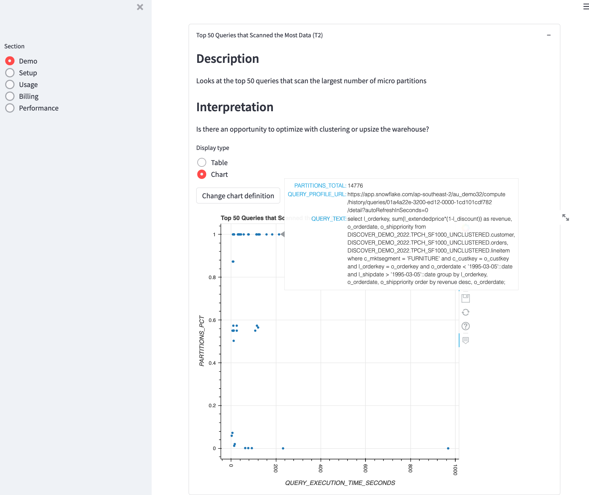
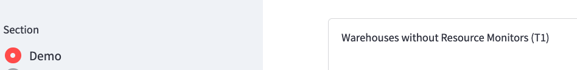
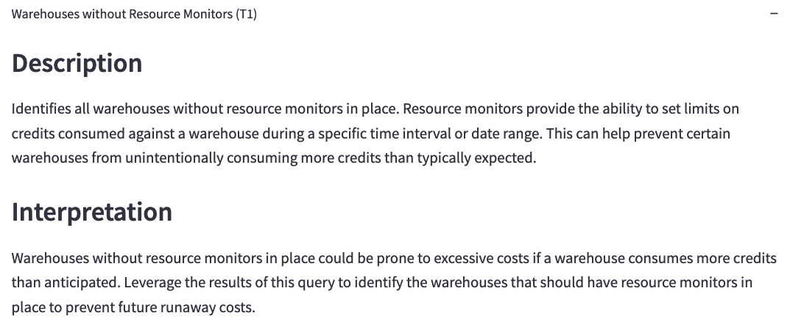

# Snowflake Performance Dashboards

## Introduction
This is a suite of Resource Optimisation queries obtained from the Snowflake Quickstarts website at https://quickstarts.snowflake.com and inserted into a Streamlit app using a config file. 

As the charts are (mostly) automatically generated from the config file, you can add and remove queries as they are applicable to you without adding/changing code. You can also change the charts at runtime if necessary.



### When should I use this?
This is designed to help get you going _really quickly_ with the queries found in the Quickstarts. Perhaps, over time, it can become more fully featured, but at the moment it's pretty rough and ready. 
It is, however, very flexible, and if you learn Streamlit, you'll find that this is a pretty good start to building out more (not perfect - Pull Requests wanted!)

If you're looking for a great set of monitoring dashboards, I recommend checking out [this Medium post on building monitoring in Snowsight](https://medium.com/snowflake/monitoring-snowflake-with-snowsight-e9990a2898f1) or leveraging dashboards for [Tableau](https://www.tableau.com/snowflake-cloud-monitoring), [Power BI](https://github.com/mattfeks/Snowflake-PowerBI) or [Qlik](https://community.qlik.com/t5/Technology-Partners-Ecosystem-Documents/Qlik-amp-Snowflake-Usage-Dashboard/ta-p/1646629).

### Is this.... _finished_?
Heavens no. I'd like to add more chart types, for example, but the next thing that _really_ needs to be done is a clean-up of all the queries that were automatically imported from the quickstarts. A lot of the engine is built, but most of the configuration is auto-derived and so the default chart settings need to be rigged up. If you find yourself using this regularly, and you have a set of defaults you'd like to contribute, please do submit a pull request. 

## Installation and Use
To get started, clone this repository or download the zip. Then:
1. Use Conda to install the dependencies into a new Conda environment with `conda env create -f environment.yml` from within the directory you cloned/downloaded.
2. Activate the environment using `conda activate DiscoverPerformance`
3. Navigate to `.streamlit` and rename `sample_secrets.toml` to `secrets.toml`.
4. Within your new `secrets.toml`, change the sample values to match your Snowflake account.
5. From the main directory, run `streamlit run discover_performance.py`. 

Streamlit _should_ automatically open your default browser to the front page (Demo), which runs a couple queries that I discussed in my recent talk at Snowflake Discover. From there, you can use the sidebar on the left to go to any group of queries. The queries are grouped as per their grouping in the four Resource Optimisation quickstarts. 

From here, it is as simple as waiting for the queries to load (some can take a little while - they do cache fairly well though), scrolling through the queries and viewing them either as tables or as charts as you prefer.
The chart axes can also be configured by clicking "Change chart definition". (X and Y are fairly self-explanatory, Z will appear as you hover over data points. If a URL is detected in Z, clicking a datapoint will open a new tab for that URL.)

## Configuration and Extension
The app has been built to be both configurable and extensible. While, at this stage, most of the queries are straight out of the quickstarts with little manual improvement made, the app does allow for the addition of new queries to suit your environment, and also setting display defaults that make your life easier.

### Adding and Deleting Sections
To add a new section, simply add a top level tag into `./sections/queries.toml`, similar to the out of the box `Demo`, `Setup`, `Usage`, `Performance` and `Cost` sections. 
To delete one, simply delete the top level tag _and all the queries associated with it_ (ie. queries with the tag `[Section."Query Name"]`). 

### Adding and Deleting Queries
To add a new query, add a second level tag to `./sections/queries.toml` under the top level tag for the section that you want to add the new query in. The tag you use will be used to determine the name of the query. For example:

```toml
[demo]
    [demo."Warehouses without Resource Monitors (T1)"]
```
This results in the following Section -> Query relationship:


### Query Fields
#### Query Definition
A query needs either a `query_file`, which is a reference to the file path containing your query, or a `query`, which is the SQL that you want to run. I'd recommend only using very short queries in the config file and keeping longer queries in their own separate files. For example:
```toml
[demo]
    [demo."Warehouses without Resource Monitors (T1)"]
        query_file = "./sections/queries/Warehouses without Resource Monitors (T1).sql"
```

Queries can also use parameters from either the secrets file (but not the password), or by including a params key - see below. To reference parameters within your query, include them within curly braces. So, for example, to include your account name in the query text, you could refer to it as `{params.snowflake.account}`. 

#### Query Documentation
The query description, and advice for interpreting the results, can be defined with `description` and `interpretation` respectively:
```toml
[demo]
    [demo."Warehouses without Resource Monitors (T1)"]
        query_file = "./sections/queries/Warehouses without Resource Monitors (T1).sql"
        description = """Identifies all warehouses without resource monitors in place.  Resource monitors provide the ability to set limits on credits consumed against a warehouse during a specific time interval or date range.  This can help prevent certain warehouses from unintentionally consuming more credits than typically expected."""
        interpretation = """Warehouses without resource monitors in place could be prone to excessive costs if a warehouse consumes more credits than anticipated.  Leverage the results of this query to identify the warehouses that should have resource monitors in place to prevent future runaway costs."""

```

#### Query Parameters

To add query parameters that aren't defined in `secrets.toml`, use dot notation as follows:

```toml
[demo]
    [demo."Warehouses without Resource Monitors (T1)"]
        query_file = "./sections/queries/Warehouses without Resource Monitors (T1).sql"
        params.param1 = "foo"
        params.param2 = "bar"
```

#### Multi-queries
Sometimes you need to run multiple queries to get the session to the point you want, like for example `SHOW TABLES` before a RESULT_SCAN. By default, the app will show the results from all queries in `query`/`query_file`. To only run the first queries silently and only show the results from the last one, use `only_show_last = true`.

```toml
[demo]
    [demo."Warehouses without Resource Monitors (T1)"]
        query_file = "./sections/queries/Warehouses without Resource Monitors (T1).sql"
        only_show_last = true
```

### Display and Charting
By default, all query results are shown in a table, from which the user can choose to switch to a chart. 
To change this, set the `default_mode` for the query to `chart`:

```toml
[demo."Top 50 Queries that Scanned the Most Data (T2)"]
        query_file = "./sections/queries/Top 50 Queries that Scanned the Most Data (T2).sql"
        description = """Looks at the top 50 queries that scan the largest number of micro partitions"""
        interpretation = """Is there an opportunity to optimize with clustering or upsize the warehouse?"""
        default_x = "QUERY_EXECUTION_TIME_SECONDS"
        default_y = "PARTITIONS_PCT"
        default_z = ["PARTITIONS_TOTAL", "QUERY_PROFILE_URL", "QUERY_TEXT"]
        default_mode = "chart"
```

The default X and Y axis for this chart is the first and second columns in the query result respectively, but this can be changed (as per the example above) using the `default_x` and `default_y` parameters. `default_z`, which is a list, defines the default fields shown when you hover over a data point. 
